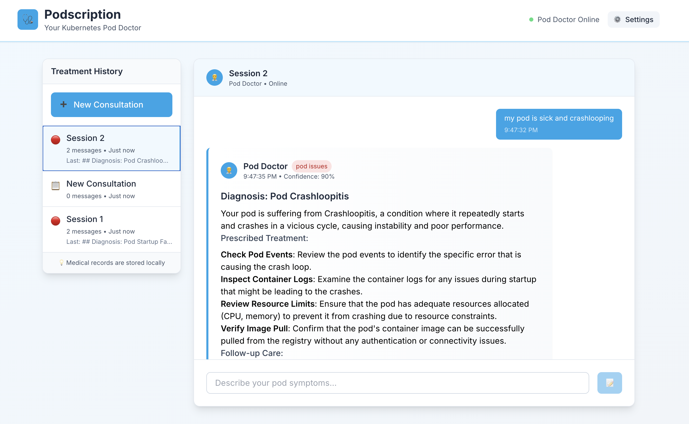

# 🩺 Podscription

> Your Kubernetes Pod Doctor - AI-powered troubleshooting for cluster issues

Podscription is a web-based Kubernetes troubleshooting assistant that helps you diagnose and resolve cluster issues through natural language interaction with AI.



## ✨ Features

- **🎯 Intent-Based Diagnostics** - Specialized AI doctors for networking, storage, and pod issues
- **💊 Prescription-Style Solutions** - Step-by-step treatment plans with kubectl commands  
- **🏥 Medical-Themed Experience** - Consultation interface with treatment history
- **📋 Expert Analysis** - Confidence scoring and follow-up recommendations

## 🚀 Quick Start

1. **Prerequisites**: Docker, OpenAI API key

2. **Setup**:
   ```bash
   git clone https://github.com/diamonwiggins/podscription.git
   cd podscription
   export OPENAI_API_KEY="your-api-key-here"
   ```

3. **Run**:
   ```bash
   task services:start
   ```

4. **Visit**: http://localhost:3000

## 💡 Example

**You**: "My pods are stuck in CrashLoopBackOff state"

**Pod Doctor**: *Provides expert diagnosis with confidence scoring, identifies likely causes, and prescribes specific kubectl commands to investigate and resolve the issue*

## 🏗️ Architecture

React + TypeScript frontend → Go API → OpenAI with expert K8s prompts

---

*🩺 "Take two kubectl commands and call me in the morning" - Pod Doctor*
